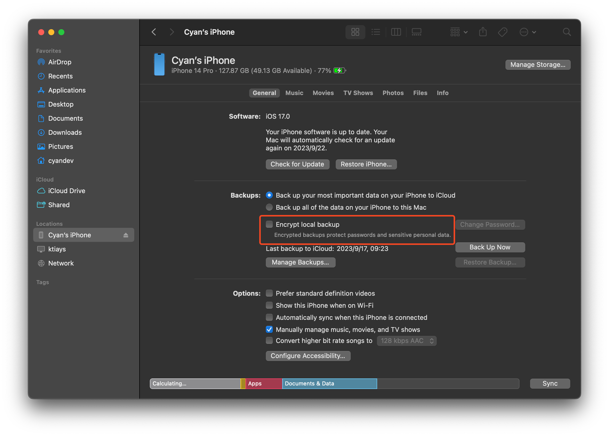

# iBackupExtractor

A simple tool for extracting files from iOS backup archive.

iOS backup files are not stored with their original directory layouts. Retrieving a particular file from the app sandbox can be difficult. This tool can extract all the files from a backup archive, and then you can view the sandbox filesystem as it was originally stored in your iPhone or iPad.

To save disk usage and speed up the extraction process, the extracted files are symbolic links to the original files in the backup archive.

## Install

### Download From GitHub Releases

For Mac users, you can download the pre-built binaries directly from [releases](https://github.com/unixzii/ibackupextractor/releases) page.

### Build Locally

To build this locally, a nightly toolchain is required. You can install it using `rustup`:

```
rustup toolchain install nightly
```

Then, you can build the executable:

```
cargo +nightly build --release
```

## Usage

Locate the backup archive you want to extract. Generally, you can find it under `/Users/cyandev/Library/Application Support/MobileSync/Backup`. **The archive is a directory that contains `Manifest.db` file.**

### List Domains

Backup files are grouped by domains, and you need to specify a domain name when extracting. To list all the domains available, run the command below:

```
ibackupextractor -l /path/to/your_backup_archive
```

### Extract a Specified Domain

To extract files, you need to specify a domain name and a destination path (an empty directory is recommended):

```
ibackupextractor -o /path/to/dest_dir /path/to/your_backup_archive SomeDomain
```

The extraction process can take minutes to finish, depends on the number of files.

In addition to the default symbolic-link mode, you can also change to copy mode by specifying `-c` flag. In copy mode, all files are copied to the destination path, and then you can delete the original backup archive freely if you want.

### Migrate a Domain Between Backups

The `migrate` subcommand lets you copy files in a domain from one backup archive to another while preserving the original directory structure:

```
ibackupextractor migrate -d SomeDomain /path/to/source_backup_archive /path/to/dest_backup_archive
```

As with extraction, you can switch to copy mode with `-c` so that real files are created in the destination backup archive:

```
ibackupextractor migrate -c -d SomeDomain /path/to/source_backup_archive /path/to/dest_backup_archive
```

## FAQ

### How to create a proper backup archive?

This tool can only handle the backup archives that are unencrypted. To backup without encryption, uncheck the following option before starting:



### Will this tool modify the original backup archive?

No, the tool will not write to any file in the backup archive.

## License

MIT
