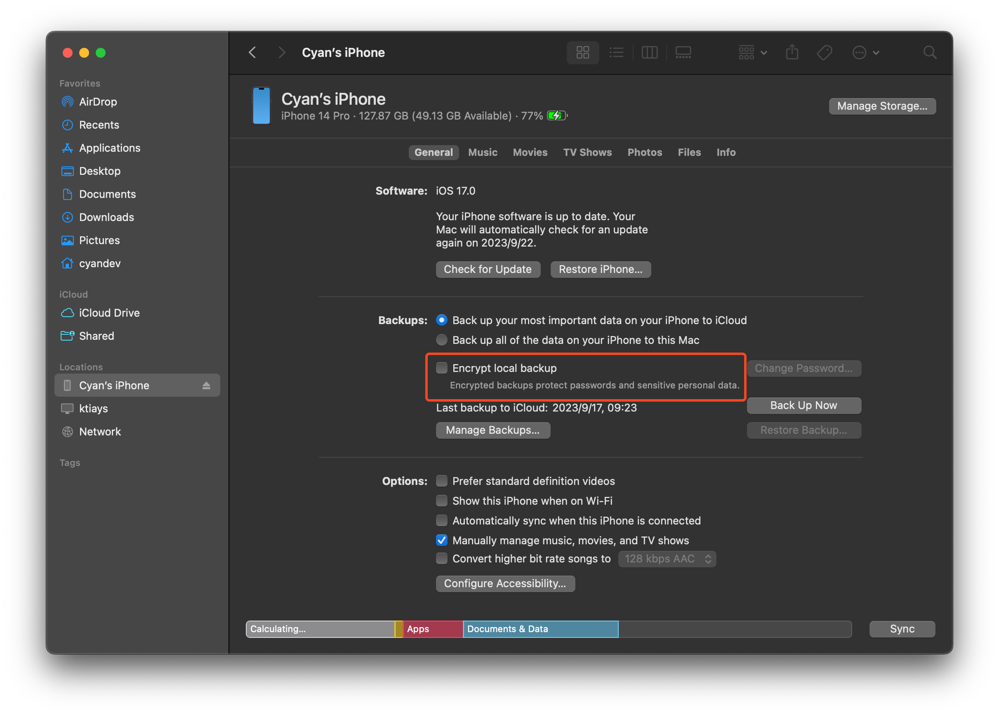

# iBackupExtractor

A simple tool for extracting files from iOS backup archive.

iOS backup files are not stored with their original directory
layouts. Retrieving a particular file from the app sandbox can be
difficult. This tool can extract files from a backup archive, and then
you can view the sandbox filesystem as it was originally stored in
your iPhone or iPad.


## Install

### Download From GitHub Releases

For Mac users, you can download the pre-built binaries directly from
the [releases](https://github.com/unixzii/ibackupextractor/releases)
page.

### Build Locally

To build the project locally, use Cargo:

```
cargo build --release
```

## Usage

First, locate the backup archive you want to extract. Usually, it can
be found in 
`/Users/<username>/Library/Application Support/MobileSync/Backup`.

**The archive is a directory that contains a `Manifest.db` file.**

Except when performing migrations, `Manifest.db` is opened in
read-only mode, so it will work even when the archive is on a
read-only filesystem (e.g. HFS+ on Linux).  However, never work on the
only copy of your data!

### Show Backup Information

The `info` subcommand shows a summary of the backup archive,
including the manifest location, timestamps, device and iTunes
metadata, total files/domains, and the overall size on disk:

```
ibackupextractor info /path/to/your_backup_archive
```

The `info` command is designed to show _archive-level_ metadata, while
`list-domains` (see below) shows information related to the _domains_
inside the archive.

### List Domains

Backup files are grouped by iOS "domains", and the `list-domains`
subcommand will show all the domains in a particular archive, sorted
by the amount of exportable data in each:

```
ibackupextractor list-domains /path/to/your_backup_archive
```

### Extract a Specified Domain

To extract files, use the `extract` subcommand followed by `-d` and
the name of the domain to extract, then the path to the archive
directory, and then a destination directory:

```
ibackupextractor extract -d SomeDomain /path/to/your_backup_archive /path/to/dest_dir
```

An empty destination directory is recommended.

By default, `extract` _copies_ each file to the destination
directory. To save disk space, use the `-L` (or `--link`) option to
create symbolic links instead of copies.

For example, to copy all Camera Roll files from an archive:

```
ibackupextractor extract -d CameraRollDomain /path/to/your_backup_archive /path/to/dest_dir
```

### Migrate a Domain Between Backups

The `migrate` subcommand lets you transfer files by domain from one
backup archive to another, while preserving the original directory
structure:

```
ibackupextractor migrate -d SomeDomain /path/to/source_backup_archive /path/to/dest_backup_archive
```

As with extraction, `migrate` copies files between backups by default.
Add `-L` if you want symbolic links instead of real files in the destination
archive.

## FAQ

### How do I create a backup archive that this tool can use?

**This tool can only handle the backup archives that are
unencrypted.** To backup without encryption, uncheck the following
option before starting:



### Will this tool modify the original backup archive?

The `info`, `list-domains`, and `extract` commands do not write to the
backup archive, and only read access to the archive is required.

The `migrate` command writes to the _destination_ archive only.  To
successfully run `migrate`, read/write access to the destination
archive is required.

## License

MIT
